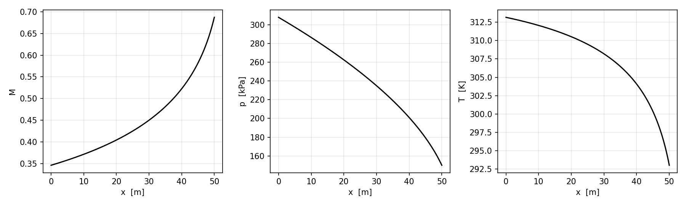

<div dir="rtl">

# نمذجة الجريان الأديباتي مع احتكاك في أنبوب ثابت المقطع

مقرر ميكانيك الموائع المتقدم، ماجستير هندسة الطاقة، كلية الهندسة الميكانيكية، جامعة حلب.
إعداد: م. محمد عيد.
بإشراف: د. سمية الراشد - د. هناء هبو.

## المسألة

يتطلب تأمين هواء بتدفق 1000 m³/min عند مخرج أنبوب ثابت المقطع بدرجة حرارة 293 K وضغط 150 kPa. القطر الداخلي للأنبوب 0.3 m وطوله 50 m. الجريان أديباتي ومعامل الاحتكاك المتوسط f = 0.005.

المطلوب: رقم ماخ عند المخرج، ضغط الهواء ودرجة حرارته عند المدخل، والتغير الإجمالي في الإنتروبي.

## التشغيل بدون تثبيت أي شيء

الدفتر `fanno_flow.ipynb` محفوظ بنتائجه، فيكفي فتحه هنا على GitHub لرؤية النتائج والرسم.

ولإعادة التشغيل بقيم أخرى اضغط الزر التالي، ثم من القائمة **Runtime ← Run all**. غيّر الأرقام في الخلية الأولى (التدفق، الحرارة، الضغط، القطر، الطول، معامل الاحتكاك) وأعد التشغيل.

</div>

[](https://colab.research.google.com/github/MohAid/energy-engineering-masters/blob/main/courses/01-advanced-fluid-mechanics/projects/fanno-flow/fanno_flow.ipynb)

<div dir="rtl">

## التشغيل على الحاسب

```
pip install -r requirements.txt
python fanno_flow.py
```

## النتائج للحالة المعطاة

| المقدار | القيمة |
|---|---|
| رقم ماخ عند المخرج M₂ | 0.687 |
| رقم ماخ عند المدخل M₁ | 0.346 |
| ضغط المدخل p₁ | 308.0 kPa |
| درجة حرارة المدخل T₁ | 313.2 K |
| التدفق الكتلي | 29.73 kg/s |
| تغير الإنتروبي Δs | 139.6 J/(kg·K) |
| الطول الأعظمي قبل الاختناق | 53.5 m |



القيم قريبة من حل الكتاب (M₂ = 0.685، p₁ = 306 kPa، T₁ = 312.8 K). الفرق الصغير سببه أن الكتاب يقرّب سرعة الصوت بـ 20.1√T ويأخذ cp = 1000 J/(kg·K)، بينما يحسبهما البرنامج من γ و R مباشرة.

## طريقة الحل

تحسب السرعة ورقم ماخ عند المخرج من التدفق الحجمي. ثم يحسب الطول اللابعدي 4fL*/D عند المخرج من علاقة فانو، ويضاف إليه 4fL/D للأنبوب فنحصل على قيمته عند المدخل. رقم ماخ عند المدخل يستخرج بحل هذه العلاقة عكسياً بطريقة التنصيف بدل الجداول، ومنه الضغط ودرجة الحرارة عند المدخل بنسب فانو، ثم تغير الإنتروبي.

## الملفات

- `fanno_flow.py` البرنامج
- `fanno_flow.ipynb` الدفتر نفسه للتشغيل على Colab
- `requirements.txt` المكتبات المطلوبة (numpy و matplotlib)
- `fanno_result.png` الرسم الناتج للحالة المعطاة

</div>
