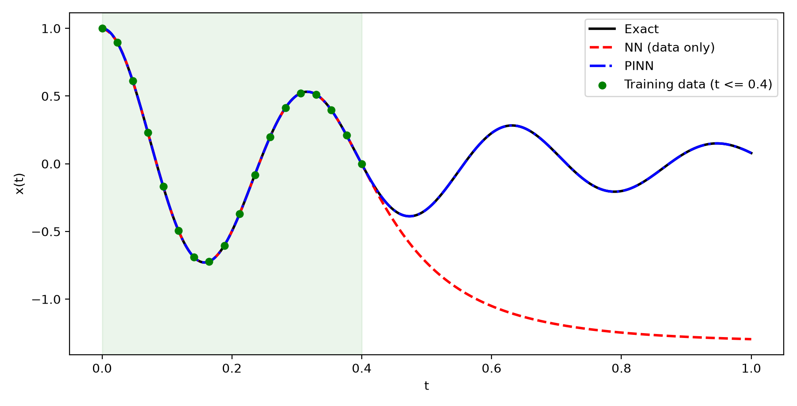

<div dir="rtl">

# بناء دالة الخسارة على متذبذب توافقي مخمد

مقرر البحث العلمي، ماجستير هندسة الطاقة، كلية الهندسة الميكانيكية، جامعة حلب.
إعداد: م. محمد عيد.
بإشراف: د. محمد يوسف الهاشم.

## المسألة

معطى ثماني عشرة قراءة مأخوذة من أول 40% من النافذة الزمنية فقط. هل تستطيع شبكة عصبونية أن تتنبأ بالحركة خارج هذه النافذة؟ الشبكة المدربة على البيانات وحدها لا تستطيع، لأن لا شيء يقيدها بعد آخر قراءة. التمرين يختبر ما إذا كانت إضافة المعادلة الحاكمة إلى دالة الخسارة تعالج ذلك.

المعادلة الحاكمة متذبذب توافقي مخمد له حل تحليلي معروف، فالمقارنة به ممكنة في كل نقطة:

</div>

```
m x''(t) + mu x'(t) + k x(t) = 0 ,   x(0) = 1 , x'(0) = 0
m = 1 , mu = 4 , k = 400
```

<div dir="rtl">

## طريقة الحل

شبكتان متطابقتان في البنية والبيانات والمحسّن وعدد الخطوات والبذرة العشوائية، ولا تختلفان إلا في وجود باقي المعادلة ضمن الخسارة. يحسب الباقي بالتفاضل الآلي عند ستين نقطة موزعة على المجال كله، بما فيه الجزء غير المرصود. التدريب على مرحلتين: Adam ثم L-BFGS. ويقاس الخطأ مقابل الحل التحليلي داخل نافذة الرصد وخارجها على حدة.

## التشغيل

</div>

```bash
pip install -r requirements.txt
python src/exp1_oscillator.py
```

<div dir="rtl">

بضع دقائق على معالج حاسب محمول. الأشكال وملف `results.json` تكتب في مجلد `out_exp1/` ينشئه البرنامج، والنسخ النهائية منها مرفوعة في `results/`.

أو من المتصفح بلا تثبيت شيء:

</div>

[](https://colab.research.google.com/github/MohAid/energy-engineering-masters/blob/main/projects/pinn/pinn-01-oscillator-foundations/notebook.ipynb)

<div dir="rtl">

## النتائج

الخطأ النسبي L2 مقابل الحل التحليلي:

| النموذج | داخل النافذة | خارج النافذة | المجال كله |
|---|---|---|---|
| بيانات فقط | 2.47e-3 | 5.63 | 2.39 |
| مستنير بالفيزياء | 1.91e-5 | 1.46e-4 | 6.43e-5 |



الشكل 1 — الحل التحليلي بالأسود، النموذج المدرب على البيانات بالأحمر، النموذج المستنير بالفيزياء بالأزرق، والقراءات بالأخضر داخل النافذة المظللة.

النموذج الأول يطابق قراءاته تقريباً ثم ينحرف تماماً بعدها، بينما يتابع الثاني الحل الصحيح على المجال كله.

## ما خرجت به

- إضافة باقي المعادلة إلى الخسارة سمحت للشبكة بالتعميم خارج بياناتها، والفرق خارج النافذة أكثر من أربع مراتب.
- حد الفيزياء يعمل كمنظّم: من بين المنحنيات الكثيرة المارة بالقراءات نفسها، يختار التدريب المنحنى الذي يحقق المعادلة أيضاً.
- قيم الخسارة النهائية غير قابلة للمقارنة بين النموذجين لأنها تقيس كميتين مختلفتين. المقارنة الوحيدة ذات المعنى هي مع حل مرجعي معروف.

## حدود التمرين

المسألة معادلة تفاضلية عادية بسيطة بحل تحليلي، وهذا ما جعل التحقق سهلاً. لا يقول التمرين شيئاً عن كلفة الطريقة على المعادلات التفاضلية الجزئية ولا عن مقارنتها بالحلّالات الشبكية، وهذا موضوع المشاريع التالية في السلسلة.

## المراجع

[1] Raissi, M., Perdikaris, P., Karniadakis, G. E. (2019). Physics-informed neural networks. *Journal of Computational Physics*, 378, 686–707.
[2] Lagaris, I. E., Likas, A., Fotiadis, D. I. (1998). Artificial neural networks for solving ordinary and partial differential equations. *IEEE Transactions on Neural Networks*, 9(5), 987–1000.

## الملفات

- `src/exp1_oscillator.py` البرنامج
- `notebook.ipynb` النسخة التي تعمل على Colab
- `results/` الأشكال و `results.json` وخرج الطرفية الكامل
- `requirements.txt` المكتبات المطلوبة

البيئة التي نفذت عليها النتائج أعلاه: PyTorch 2.5.1، حساب بدقة float64 على المعالج، Windows 11، بذرة عشوائية 0.

</div>
